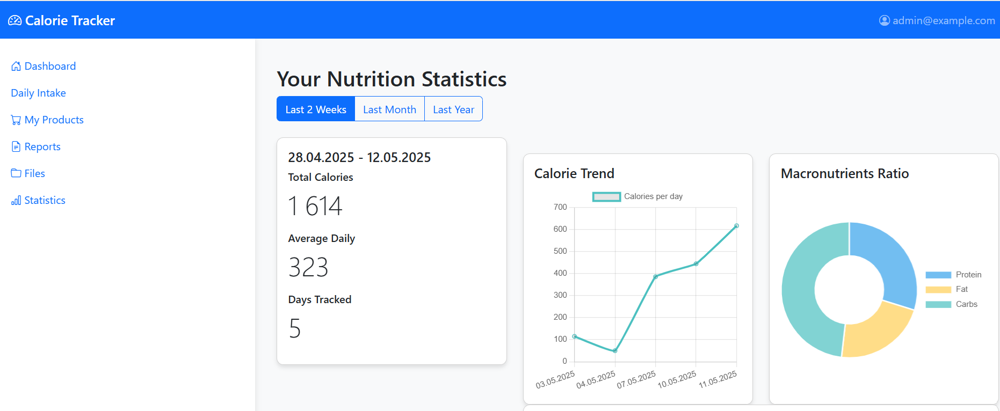

# 📱 Calories Tracker – Calorie Tracking Web Application

## 📌 Project Overview

**Calories Tracker** is a web application that helps users track their eating habits and calorie intake.  
Users can:

- Add food items
- Log meals by date
- Analyze consumption statistics
- Generate nutritional reports



---

## 🚀 Features

- 📝 Add, edit, and delete food products  
- 📊 Track daily calorie and macronutrient intake  
- 📅 Log meals for any chosen date  
- 🔐 Secure user authentication system  
- 📈 View statistics by week, month, or year  
- 📄 Generate reports in HTML format  
- 📁 Save files and reports to the database  

---

## ⚙️ Installation

### 1. Clone the repository
```
git clone https://github.com/MariaVlod/CaloriesTracker
```
### 2. Restore 
```
dotnet restore
```
### 3. Configure the database in appsettings.json
```
"ConnectionStrings": {
  "DefaultConnection": "server=localhost;port=3306;database=CalorieTracker;user=root;password=yourpassword"
}
```
### 4. Apply migrations
 ```
dotnet ef database update
```
### 5. Run the application
```
dotnet run
```

## 📚 Usage
- Register or log in

- Go to My Products to manage your food items

- Use Daily Intake to track consumption

- Analyze your data in Reports

- Set your calorie goals in the Profile section

## 🧠 Architecture & Principles
### 🧩 Programming Principles
#### SOLID Principles:

**1. Single Responsibility Principle (SRP)**
- Each service is responsible for only one specific functionality:

- CalorieService - calorie and daily meal tracking

- ProductService - product management

- UserService - user authentication and management

- ReportService - report generation

For example, CalorieService is not responsible for authentication, and UserService does not contain logic for working with products.

**2. Open/Closed Principle (OCP)**
- The system is extensible by adding new services without changing the existing code.

**3. Liskov Substitution Principle (LSP)**
- Inheritance and polymorphism are used correctly. For example, the base class User can be replaced by derived classes without breaking the system.
  
**4. DRY (Don't Repeat Yourself)**
Repeated code is placed in services and methods:
- Calorie calculation logic is encapsulated in CalorieService
- Common methods for working with the database in AppDbContext

**5. KISS (Keep It Simple, Stupid)**
- Simple architecture without unnecessary complications:
- Clear division into Models, Services, Controllers, Views
- Minimal number of design patterns
- Straightforward routing
  
**6. YAGNI (You Aren't Gonna Need It)**
Only necessary functionality is implemented:
- No premature optimizations
- No unnecessary abstraction layer
- Functions are added only when really needed
  
## 🏗️ Design Patterns
- **Service Layer** – encapsulates business logic - [CalorieService](./CaloriesTracker/Services/CalorieService.cs), [ProductService](./CaloriesTracker/Services/ProductService.cs), [UserService](./CaloriesTracker/Services/UserService.cs), [ReportService](./CaloriesTracker/Services/ReportService.cs), [FileService](./CaloriesTracker/Services/FileService.cs) 
- **Repository Pattern** – data access abstraction using EF Core
- **Dependency Injection** – via constructor injection
- **MVC (Model-View-Controller)** – core architectural pattern - [Models](./CaloriesTracker/Models/), [Controllers](./CaloriesTracker/Controllers/), [Views](./Views/)
- **Facade** – hides complex logic and provides simplified methods to the UI or controller - Example: [ReportService](./CaloriesTracker/Services/ReportService.cs) generates complex aggregated data through one method
- **Dependency Injection** – used to inject services and repositories via constructors - [Program.cs](./CaloriesTracker/Program.cs) – service registration in `builder.Services
## 🔧 Refactoring Techniques
- **Remove Dead Code** -Eliminated unused code and comments from earlier prototypes.
- **Rename for Clarity** – renamed variables, methods, and classes to more accurately reflect their purpose  
- **Move Method** – relocated methods to more appropriate classes (e.g., from controller to service)  
- **Introduce Service Layer** – extracted business logic from controllers into dedicated services
- **Replace Magic Numbers/Strings** – replaced hardcoded values with constants or configuration  


## 🛠️ Technologies Used
- ASP.NET Core
- Entity Framework Core
- MySQL
- Bootstrap 5
- HTML5 / CSS3
- Chart.js – for graphical statistics

#### Created By: Maria Vlodzianovska. Lab6

